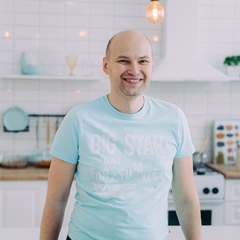
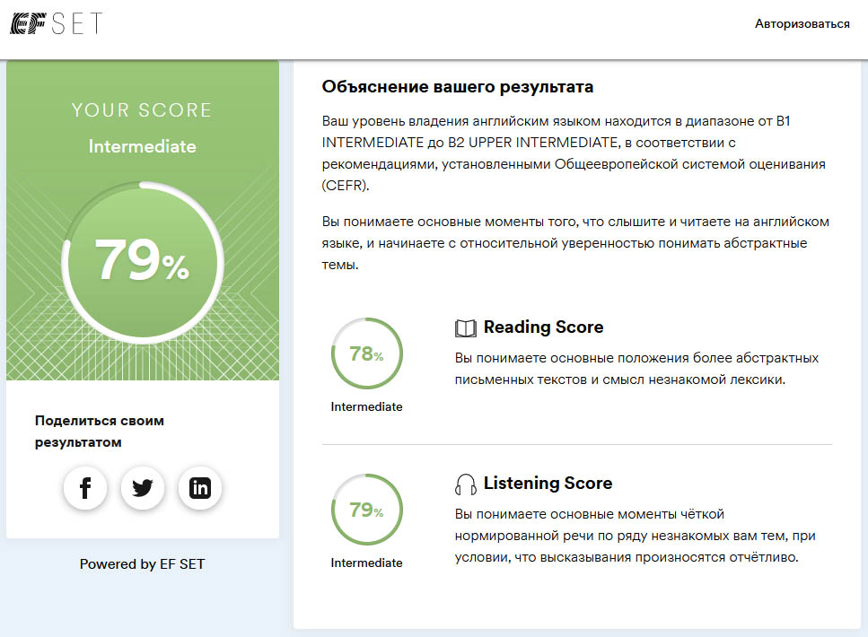

# Ivan Aliseiko

## Contacts

* **Location:** Minsk, Belarus
* **Phone:** +375 (29) 1-199-198
* **Email:** aliseiko.dev@gmail.com
* **GitHub:** [Aliseiko](https://github.com/Aliseiko)
* **Telegram:** @ivanaliseiko

## About Me

My current job is not related to programming, but I have a great desire to learn this profession.

A couple of years ago I was invited to engage in search engine promotion of a travel site. Being engaged in SEO, I had to change the HTML code of the pages and I liked it.

Now I am self-educated, studying web programming and want to change my profession to a web developer.

My core strengths are:
* fast learning
*  hard work
*  teamwork skills

## Skills

* **HTML**
* **CSS**
* **JavaScript** (in progress)

## Code example

**Codewars Kata:** Reverse every other word in the string.\
*Reverse every other word in a given string, then return the string. Throw away any leading or trailing whitespace,
while ensuring there is exactly one space between each word. Punctuation marks should be treated as if they are a part
of the word in this kata.*

```
function reverse(str) {
    return str.split(' ').reduce((acc, item, index) => {
        if (index % 2 === 0) {
            acc += ' ' + item;
        } else {
            acc += ' ' + item.split('').reverse().join('');
        }
        return acc.trim();
    }, '');
}
```

## Education

* **Belarusian National Technical University**
    * Autotractor Faculty
        * Traffic organization and transport management
* **Code Basics**
    * [HTML](https://ru.code-basics.com/languages/html)
    * [CSS](https://ru.code-basics.com/languages/css)

## Experience

SEO specialist on [DL-Navigator](https://dl-navigator.by/) project (travel company website)

## Languages

* **Russian** - native speaker
* **English** - B1 (intermediate) according to [EFSET](https://www.efset.org/quick-check/)


